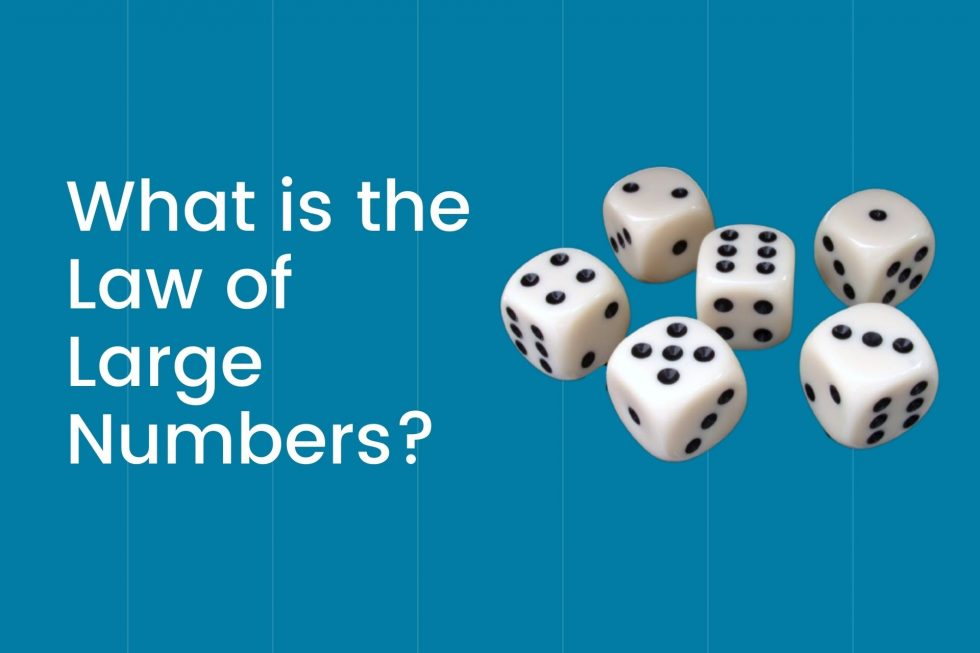

# Lei dos Grandes Números

A Lei dos Grandes Números é um dos teoremas mais importantes da probabilidade e que também é utilizado em outras áreas, como na agricultura e economia.

Segundo essa Lei a média aritmética dos resultados da realização da mesma experiência repetidas vezes tende a se aproximar do valor esperado à medida que mais tentativas se sucederem. Em outras palavras, quanto mais tentativas são realizadas, mais a probabilidade da média aritmética dos resultados observados irá se aproximar da probabilidade real.

Podemos então dizer que quanto maior o número de amostras mais ela tenderá ao valor esperado, simplificando, se um evento tem uma probabilidade teórica definida, quanto mais amostras desse evento for apresentadas mais o resultado desse evento tenderá a essa probabilidade teórica.

Nesse projeto iremos ilustrar gráficamente como essa Lei funciona.

  

